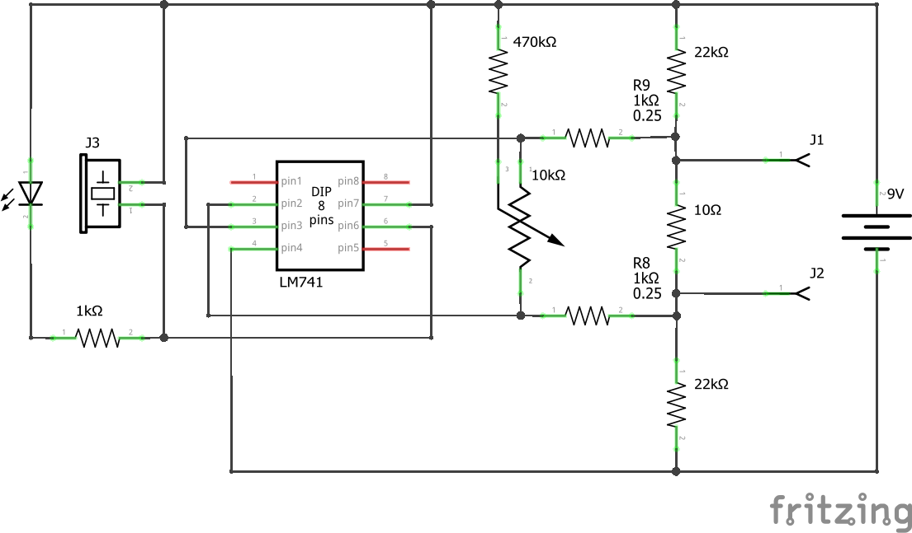
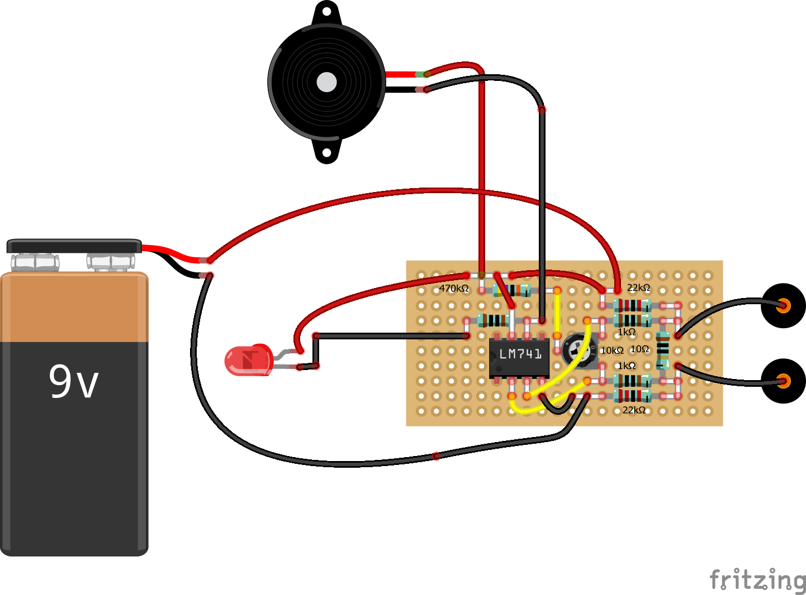

# Continuity Tester

It turns out that my multi-meter has a more liberal idea of continuity than I'd like.

I adapted this circuit from one I found on the Internet (can't locate the reference).  It uses an open loop `Op Amp` to create a sensitive continuity checker that can be calibrated via the preset pot.

