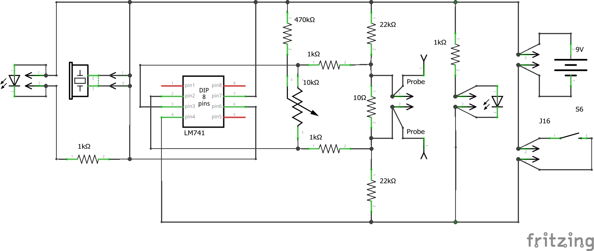
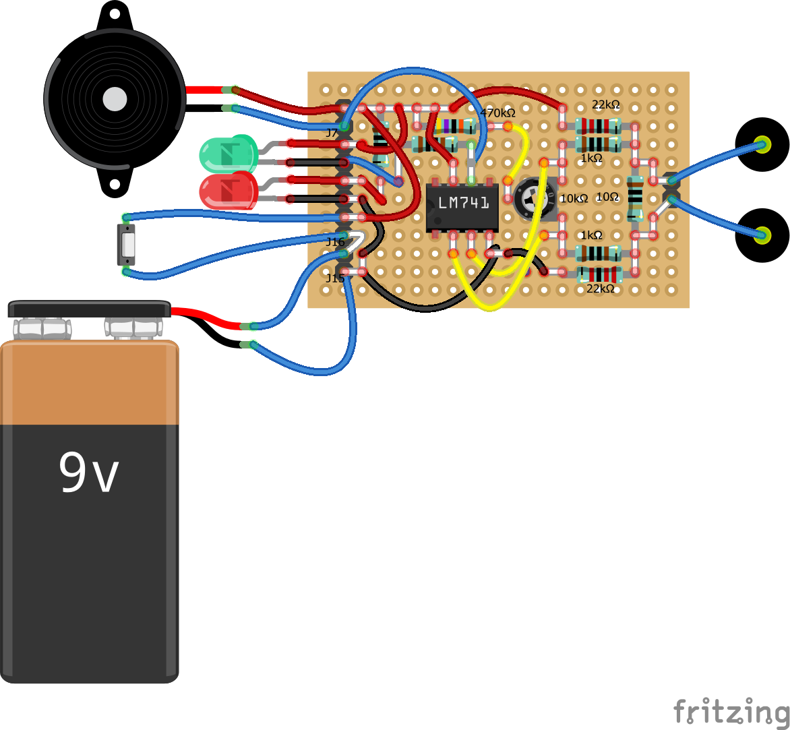

# Continuity Tester

It turns out that my multi-meter has a more liberal idea of continuity than I'd like.

I adapted this circuit from one I found on the Internet (can't locate the reference).  It uses an open loop `Op Amp` to create a sensitive continuity checker that can be calibrated via the preset pot.

A simulation of the circuit may be found [here](https://falstad.com/circuit/circuitjs.html?ctz=CQAgjCAMB0l5YCsA2ATI8ZYA5kHZVU8x0BObE5EPSEDAFgGY6BTAWjDACgA3EZbNhCNs9foJDZa0kPVqkoimIi4AnOvTGdUGrXiq1C8NbLBUwpHfSnhLisMfWJNIVBOdiRYw6ke7XqGIergT2kFwA7v5g+tF24er0Zq4S1oYStA5wkbI2FjrB+VA5wW5CaSlC4VECQjbBNtX+9S7axVHBXuJCXeExnog6hJ6irijg4PDS0IOkNFMLCCAASiwAzgCWawAuAIYAdgDGLCUuNklUjTkXkrQ3bU2MgwEDOkWPz+hUT0Ohj6NlUxUQEfN52e7xU5aOylQLtfxEAouEE5H6VYQAjKoz6hNEoqJdQJ3ZJE+GFOzISBCd45SnUilUl5k5ESOnoppswGcv4mTlw7k6TIme4kIHgSmKejzbJRG6k+4S8K7JmksyGOQgBQKTKLWTQSk0PCIUiIRiMZCMEj0Bj6yD4GjWKTOMD0ZAYLLGKLDJmMSBib2PP0+oM0gkhuxo0Mq8a+-3jQNx75B-HCZMSPFY9TJNXi1yMnUy8XqzLAjVNEkakn5rhmN6XEvgNyuEAAExYADNdgBXAA22zYPZYLYmMhgCBy2ab2cV12SeXrxQA9il+N5TJBmGOEEYaJb0FBYHA8BR94YV8wADKL3YtrjLxgKZBrpIbg9TfSoUgP617jBjkjus2D7CCAADyAAOAA6awAIIALZQWsi5dtsd7CDoT72G4dp6gakBGiaZoWlaf6HksVjoSBTyKNRzAQdB8GIQAkvsXAiCuABiECZJMtAcCAV43lwQA).

## Schematic

## Proto Board

## Implementation

